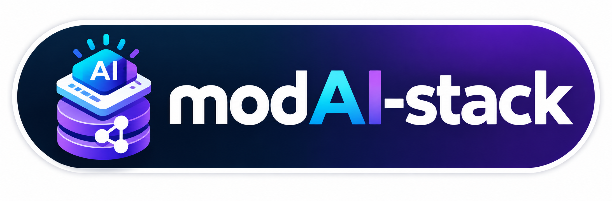
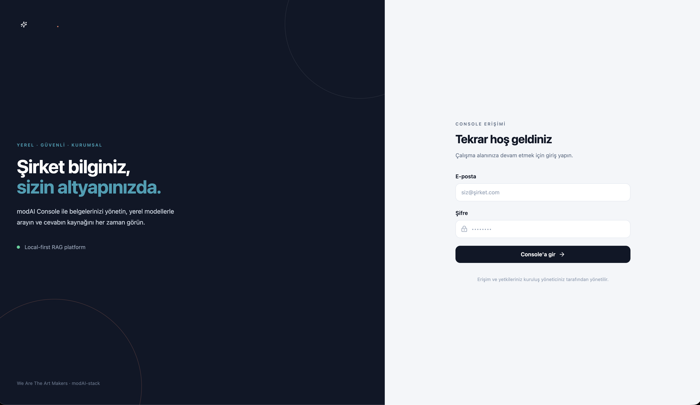
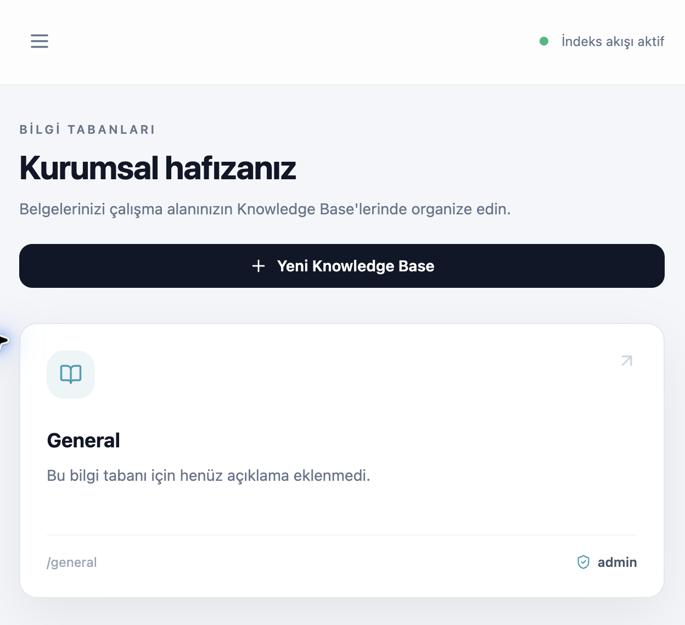
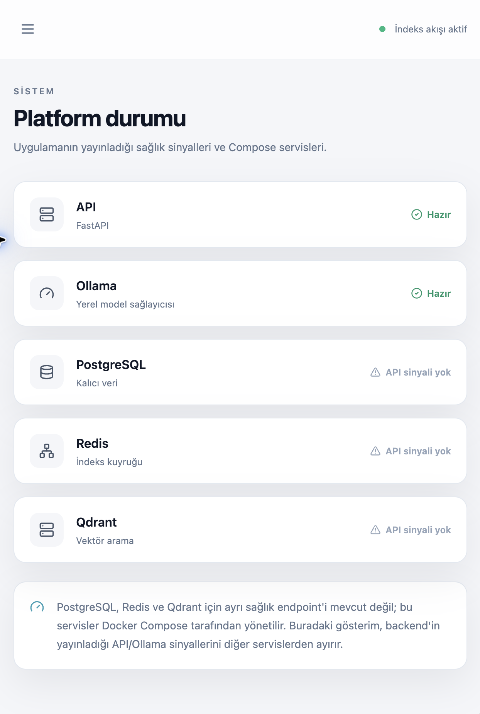
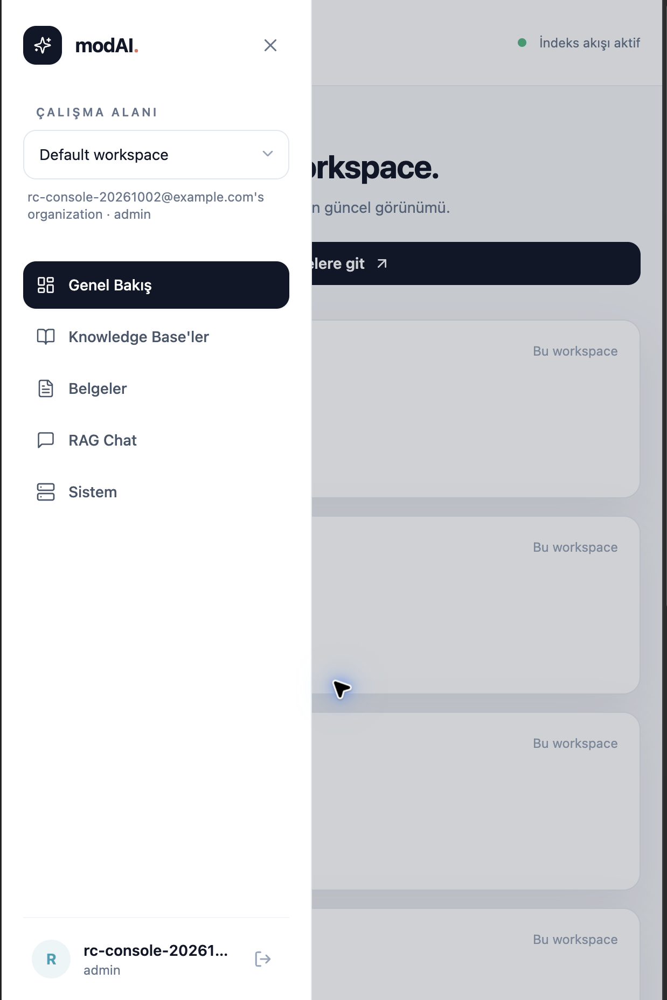

# modAI-stack

<p align="center"></p>

> **YEREL · ÖZEL · KURUMSAL · KAYNAKLI YANITLAR · ON-PREMISE**

modAI-stack, şirketlerin iç belgelerini kendi altyapılarında tutup yetkili çalışanların doğal dille arayabildiği yerel-öncelikli kurumsal bilgi platformudur. Belgeler Organization → Workspace → Knowledge Base yapısında düzenlenir; yerel LLM yanıtları erişilebilir kaynaklarla birlikte sunulur. Yerel/on-premise kurulumda belge ve sorgu içeriği varsayılan olarak bir bulut LLM servisine gönderilmez.

Organization, Workspace ve Knowledge Base sınırları rol tabanlı erişimle korunur. Çok dilli retrieval profilleri için mimari hazırlanmaktadır; mevcut embedding baseline'ı İngilizce odaklıdır ve Türkçe optimizasyonu iddia edilmemektedir. Bu proje herhangi bir güvenlik sertifikası iddiasında bulunmaz.

[GitHub deposu](https://github.com/WeAreTheArtMakers/modAI-stack)


## Commercial deployments

modAI-stack is publicly developed as the core of a private enterprise
knowledge AI platform.

Commercial pilots, supported self-hosted deployments, enterprise
implementation, and customer-specific integrations are available separately.

**Pricing & commercial deployments:**  
https://wearetheartmakers.github.io/modAI-stack/

Future enterprise-only capabilities may be developed in separate proprietary
modules and are not necessarily distributed through this public repository.


## Ürün arayüzü

<p align="center"></p>
<p align="center"><em>Kuruluşunuzun kendi çalışma alanından özel belge zekâsına giriş.</em></p>

<table>
  <tr>
    <td width="33%"><strong>Kurumsal bilgi tabanları</strong><br>Şirket bilgisini çalışma alanları ve yetkili Knowledge Base'ler altında düzenleyin.</td>
    <td width="33%"><strong>Yerel sistem görünümü</strong><br>API ve yerel model sinyallerini, ayrıca ayrı sağlık sinyali olmayan servisleri açıkça görün.</td>
    <td width="33%"><strong>Çalışma alanı ve erişim</strong><br>Workspace seçin; sohbet, belgeler ve yönetim alanlarına tek menüden ulaşın.</td>
  </tr>
</table>

## Search / Retrieval Profiles

Yöneticiler ileride embedding model adları yerine dil ve donanım ihtiyacına göre bir arama profili seçebilecek. Şimdilik katalog ve aktif profil durumu salt okunurdur; model değiştirme veya yeniden indeksleme başlatan bir işlem yoktur.

| Profil | Kullanım hedefi | Yerel kaynak sınıfı | Durum |
| --- | --- | --- | --- |
| Compact Multilingual | Türkçe + İngilizce + çok dilli kullanım; düşük bellek ve hızlı yerel kurulum | Düşük | Deneysel; model eşlemesi ve ölçüm bekliyor |
| Balanced Multilingual | Çok dilli retrieval ile kaynak kullanımı arasında denge | Orta | Model sağlama ve benchmark bekliyor |
| Advanced Long-Document | Uzun belgeler ve çok dilli koleksiyonlar | Yüksek | Yapılandırılmadı |
| English Optimized | Mevcut hafif, İngilizce odaklı embedding baseline'ı | Düşük | Aktif profil eşlemesi; Türkçe performansı ölçülmedi |

Çok dilli profiller için nihai model atamaları aynı robustness korpusu üzerinde benchmark edilmeden doğrulanmış üretim varsayılanları sayılmayacaktır. Embedding modeli veya vektör boyutu değiştiğinde eski vektörler yeni uzayla uyumlu olmayabilir; profil değişimi gelecekte açıkça onaylanan bir migration/reindex işlemi olmalıdır. [Sonraki embedding benchmark planı](docs/roadmap/retrieval-profile-embedding-benchmark.md).

Giriş yapmış kullanıcılar mevcut kataloğu `GET /retrieval/profiles` ve etkin yapılandırma eşleşmesini `GET /retrieval/status` ile okuyabilir. Bu yanıtlar model kimliği veya cache/dosya yolu içermez; bu milestone'da profil değiştirme endpoint'i yoktur.

## Proje hakkında

modAI-stack; Ollama üzerinde yerel model çalıştırmayı, belge yüklemeyi, asenkron indekslemeyi, semantik aramayı ve yanıtları WebSocket ile gerçek zamanlı aktarmayı sağlar. FastAPI ve `asyncio` tabanlıdır. PostgreSQL kalıcı verileri, Redis indeks iş kuyruğu ve ilerleme olaylarını, Qdrant ise vektör aramayı destekler. Model sağlayıcı arayüzü sayesinde Ollama yerine başka bir sağlayıcı eklenebilir.

Kullanıcı kaydı sırasında başlangıç Organization, Workspace ve Knowledge Base oluşturulur. Knowledge Base erişimi Membership kayıtlarıyla kontrol edilir; `admin`, `manager` ve `user` üyelik rolleri belge, Knowledge Base, RAG ve workspace işlemlerini tenant kapsamı içinde sınırlar. Belge ve Qdrant erişimi bu kapsam bilgileriyle ilişkilendirilir.

### Platform rolü ve tenant üyeliği

Sistemde birbirinden bağımsız iki yetki alanı bulunur:

- **Platform rolü** (`User.role`): Makine genelindeki işlemleri belirler. Yalnızca platform `admin`, Ollama model çekme/silme ve gelecekteki platform yönetimi gibi host düzeyindeki işlemleri yapabilir.
- **Tenant üyelik rolü** (`Membership.role`): `workspace_id=NULL` olan kayıt Organization-genelidir; belirli bir `workspace_id` ise yalnızca o Workspace için geçerlidir. `admin`, `manager` ve `user` rolleri yalnızca yetkili Organization, Workspace ve Knowledge Base içindeki belge/RAG işlemlerini yönetir.

Bu nedenle bir kullanıcı platform rolü `user` iken kendi workspace’inde üyelik rolü `admin` olabilir. Bu beklenen davranıştır; workspace yöneticiliği platform yöneticiliği vermez. Ayrıca workspace-scoped `admin`, Organization yöneticisi değildir: workspace oluşturma, Organization-geneli üyelik yönetimi ve davet yönetimi yalnızca platform `admin` veya `workspace_id=NULL` olan Organization-geneli `admin` üyeliğiyle yapılabilir. Organization yöneticiliği de platform yöneticiliği vermez.

## v0.3 — Enterprise Local AI Platform

v0.3, yerel-öncelikli kurumsal RAG platformu kilometre taşıdır. Production hardening ve Model Manager v0.3 bu sürümde tamamlandı. O dönemki backend doğrulama paketi 85 test ile CI'da doğrulanmıştır; güncel test komutu aşağıdaki Test ve LoRA eğitimi bölümündedir.

- Çok tenantlı Organization → Workspace → Knowledge Base hiyerarşisi, Membership tabanlı yetkilendirme ve tenant izolasyonu kullanılmaktadır.
- Gerçek canlı RAG kabulü tamamlandı: TXT, PDF ve DOCX yükleme/çıkarma, Qdrant retrieval, kaynaklı HTTP ve WebSocket yanıtları doğrulandı.
- Reindex, replace/sürüm aktivasyonu ve belge silme/Qdrant vektör temizliği gerçek servislerle doğrulandı; [Issue #4](https://github.com/WeAreTheArtMakers/modAI-stack/issues/4) kapatıldı.
- Embedding modeli bağlı kurulumda önceden hazırlanabilir; çalışma zamanında varsayılan olarak cache-only/offline davranışı korunur.
- WebSocket bağlantıları normal access JWT yerine kısa ömürlü, tek kullanımlık ticket ile kurulur.

Bu durum bir güvenlik veya uyumluluk sertifikası iddiası değildir. Dağıtımın TLS, yedekleme, erişim sınırları ve secret yönetimi gereksinimleri işletmecinin sorumluluğundadır.

## v0.4 — Enterprise Administration

Enterprise Administration; platform kullanıcı dizini, Organization ve Workspace yönetimi, scope’lu Membership yönetimi, Audit Log ve yönetim arayüzünü ekler. Davet token’ları yüksek entropili üretilir, yalnızca SHA-256 hash’i saklanır, tek kullanım ve son kullanma süresiyle korunur. Kabul sırasında hedef e-posta karşılaştırması normalize edilir ve davet satırı transaction içinde kilitlenir.

- Son platform yöneticisi düşürülemez; her Organization’da en az bir Organization-geneli `admin` üyeliği korunur.
- PostgreSQL’de `workspace_id IS NULL` Organization üyelikleri için kısmi unique index bulunur. Migration, önceden oluşmuş çift Organization-geneli üyelikleri silmez; operatörden önce bunları düzeltmesini ister.
- Yönetim arayüzü Organization-geneli işlemleri yalnızca gerçek Organization-geneli admin üyelerine veya platform admin’lere gösterir. Backend bu sınırı ayrıca zorunlu olarak uygular.
- Yerleşik SMTP dağıtımı yoktur; davet token’ı yalnızca oluşturulurken bir kez gösterilir ve kurumun seçtiği güvenli kanal üzerinden iletilir.

## v0.5 geliştirme — RAG Evaluation & Quality

Bu geliştirme dalı, mevcut RAG davranışını değiştirmeden retrieval ve cevap desteğini ölçülebilir, tekrar çalıştırılabilir hale getirir. Sürümlü, insan gözden geçirmeli evaluation dataset’leri; canonical SHA-256 dataset fingerprint’i; sabit belge-ID öncelikli kaynak eşlemesi; deterministik kaynak/fact metrikleri; JSON sonuç şeması; eşik kontrollü CLI ve baseline/candidate karşılaştırması bulunur. Aynı adlı iki belge, farklı belge kimlikleri sayesinde yanlış pozitif kaynak eşleşmesi oluşturmaz. Bulut LLM judge kullanılmaz. Değerlendirme çalıştıran kullanıcı, RAG endpoint’iyle aynı Knowledge Base yetkilendirmesine tabidir; yetki reddi retrieval başlamadan uygulanır. Sonuç dosyaları belge gövdesi, prompt, üretilmiş tam yanıt veya token içermez.

Detaylı şema, metrik sınırları, embedding modeli değiştiğinde reindex uyarısı ve komut örnekleri için [evaluation/README.md](evaluation/README.md) dosyasına bakın.

## Kullanılan teknolojiler

| Katman | Teknolojiler | Kullanım amacı |
| --- | --- | --- |
| Dil ve API | Python 3.11+, FastAPI, Pydantic, Uvicorn | Asenkron REST API ve doğrulama |
| Asenkron mimari | `asyncio`, bounded queue, worker, timeout, cancellation | Eşzamanlılık ve backpressure |
| LLM | Ollama, `LLMProvider` | Yerel model ve sağlayıcı soyutlaması |
| RAG | Sentence Transformers, metin parçalama | Belge kaynaklı yanıt üretimi |
| Vektör arama | Qdrant, cosine similarity, metadata filtreleri | Embedding saklama ve arama |
| Kalıcı veri | PostgreSQL, SQLAlchemy Async ORM, asyncpg | Kullanıcı, belge, oturum ve mesajlar |
| Geçici veri ve işler | Redis | Asenkron indeks kuyruğu, retry ve workspace kapsamlı ilerleme olayları |
| Gerçek zamanlı iletişim | WebSocket | Token akışı ve canlı sohbet |
| Güvenlik | JWT, access/refresh token, bcrypt, RBAC | Kimlik doğrulama ve yetkilendirme |
| Belge işleme | `pypdf`, `python-docx`, Markdown, TXT | Dosyadan metin çıkarma |
| Model uyarlama | Transformers, Datasets, PEFT / LoRA | Adapter eğitimi |
| Altyapı | Docker, Docker Compose, kalıcı volume | Yerel servis kurulumu |
| Test | pytest, pytest-asyncio, httpx | Birim ve entegrasyon testleri |

## Mimari

```text
İstemci -> FastAPI REST/WebSocket -> JWT/RBAC -> LLMProvider -> Ollama
                                      |              |
                                      |              └-> RAG -> Embedding -> Qdrant
                                      ├-> SQLAlchemy -> PostgreSQL
                                      └-> Redis -> indeks worker / WebSocket ilerleme olayları
```

Ollama çağrıları yalnızca `app/services/llm/` katmanından yapılır. RAG context’i güvenilmeyen veri olarak sistem talimatlarından ayrılır.

### Gerçek RAG akışı

Belge yükleme akışı şöyledir: `upload → extract → chunk → embed → Qdrant upsert`. Embedding modeli lazy olarak yüklenir, tekrar kullanılır ve senkron model çağrısı `asyncio.to_thread()` ile event loop dışına taşınır. Her Qdrant payload’ında kullanıcı, belge, dosya adı, parça numarası ve metin bulunur.

Sorgu akışı şöyledir: `question → embed → yetkili Organization/Workspace/Knowledge Base filtreli similarity search → top-k context → Ollama → answer + sources`. Qdrant filtreleri kullanıcı ve kurumsal kapsamla sınırlandırılır; RAG isteğinde seçilen tüm Knowledge Base kayıtları önce Membership üzerinden yetkilendirilir. Belge silme işlemi de yetkilendirme kontrolünden sonra PostgreSQL kaydını ve Qdrant vektörlerini birlikte kaldırır.

## Asenkron indeksleme ve dosya depolama

Upload isteği artık embedding çalıştırmaz. API dosyayı güvenli, üretilmiş bir adla `DATA_DIR/uploads/` altına atomik olarak kaydeder; PostgreSQL’de belge sürümü ve `IndexJob` oluşturur; işi Redis kuyruğuna bırakır ve `queued` durumuyla döner. Ayrı worker süreci `queued → processing → ready` akışında extraction, chunking, embedding ve Qdrant upsert işlemlerini yürütür. Hatalar güvenli `failed` durumuna alınır ve sınırlı retry uygulanır.

Desteklenen dosya türleri PDF, TXT, Markdown ve DOCX’tir. Kullanıcı dosya adı yalnızca metadata olarak saklanır; filesystem yolu hiçbir zaman istemciden alınmaz. Docker Compose içinde `api`, `worker`, PostgreSQL, Redis ve Qdrant servisleri bulunur; kaynak dosyalar `modaidata` volume’unda kalıcıdır.

Belge yaşam döngüsü için `POST /documents/{id}/reindex`, `POST /documents/{id}/replace`, `GET /documents/{id}/versions` ve `DELETE /documents/{id}` endpoint’leri bulunur. Replace işleminde yeni sürüm indekslenene kadar eski sürüm aktif kalır; başarılı sürüm aktivasyonundan sonra eski Qdrant noktaları temizlenir.

İndeks ilerleme WebSocket’i için istemci önce access JWT ile yetkili `POST /auth/ws-ticket` çağrısı yapar ve `{"scope":"indexing","workspace_id":<id>}` gönderir. Backend, ticket üretmeden önce workspace erişimini doğrular. Dönen kısa ömürlü, tek kullanımlık ticket yalnızca `ws://localhost:8000/ws/indexing?ticket=<ticket>` adresinde kullanılır. Bu kanal `queued`, `extracting`, `chunking`, `embedding`, `vector_indexing`, `ready` ve `failed` olaylarını yayınlar; access JWT ve workspace kimliği WebSocket URL’sine konmaz.

## Kurulum

```bash
python -m venv .venv && source .venv/bin/activate
pip install -r requirements-runtime.txt
# Yalnızca ilk kurulumda; mevcut yerel .env dosyasını üzerine yazmayın.
cp .env.example .env
```

Bağımlılıklar kullanım amacına göre ayrılmıştır:

```bash
# API, worker ve RAG runtime
pip install -r requirements-runtime.txt

# Runtime + backend test araçları
pip install -r requirements-dev.txt

# Runtime + LoRA/PEFT eğitim araçları
pip install -r requirements-training.txt
```

`requirements.txt`, eski tam kurulum alışkanlığı için uyumluluk giriş noktasıdır; runtime, geliştirme ve eğitim bağımlılıklarını birlikte kurar. Production API/worker imajı yalnızca `requirements-runtime.txt` kullanır. SentenceTransformers için gereken `torch` ve `transformers` runtime'da kalır; `datasets`, `peft` ve `accelerate` ise LoRA eğitim ortamına bilinçli olarak ayrılmıştır.

### Yerel geliştirme / Uygulamayı çalıştırma

**Tam sistem:** Depo kökünde `.env` içindeki `POSTGRES_DB`, `POSTGRES_USER` ve `POSTGRES_PASSWORD` değerlerini yerel veritabanınızla uyumlu biçimde ayarlayın; mevcut PostgreSQL volume'unun kimlik bilgilerini değiştirmeyin. Ardından:

```bash
docker compose up --build
```

Compose; `frontend`, `api`, `worker`, `postgres`, `redis` ve `qdrant` servislerini başlatır. Arayüz `http://localhost:5173`, API `http://localhost:8000`, Qdrant `http://localhost:6333`, host tarafından erişilen PostgreSQL ise `localhost:55432` adresindedir. Arayüzün `/api` ve `/ws` istekleri mevcut Nginx yapılandırmasıyla API'ye yönlendirilir. Docker içindeki API, Mac'teki Ollama'ya `host.docker.internal:11434` üzerinden bağlanır. `GET /health` yalnızca API'nin ayakta olduğunu; `GET /ready` ise bağımlılıkların durumunu gösterir. Tam RAG için Ollama generation modeli ve SentenceTransformer embedding modeli ayrıca hazır olmalıdır.

**Release imajları:** API, worker ve frontend’in aynı Git kaynağını raporlaması için üç imajı tek build argümanıyla oluşturun:

```bash
BUILD_SHA="$(git rev-parse HEAD)" docker compose build api worker frontend
```

SHA kalıcı `.env` ayarı değildir; doğrudan build’e aktarılır. Sistem sayfası frontend/backend kısa SHA’larını gösterir, uygulama da geçerli iki release SHA’sı farklıysa elle yenileme uyarısı verir. Version observability özelliğinin ilk dağıtımı, bu kodu henüz içermeyen eski açık sekmeleri algılayamaz; bu sekmelerin bir kez yenilenmesi gerekir. Sonraki dağıtımlar feature’ı yüklemiş sekmelerde otomatik tespit edilir.

**Host üzerinde backend geliştirme:** Depo kökünde çalışın; PostgreSQL, Redis ve Qdrant erişilebilir olmalıdır. Yerel `.env` içindeki `DATABASE_URL` **`postgresql+asyncpg://`** sürücüsünü kullanmalı ve Compose PostgreSQL'i için `localhost:55432` adresini göstermelidir (`.env.example` içindeki `5432` değeri host Compose portu değildir). API konteyneri zaten host `8000` portunu kullanıyorsa onu ve host Uvicorn'u aynı anda bu portta çalıştırmayın.

```bash
source .venv/bin/activate
python -m uvicorn app.main:app --host 127.0.0.1 --port 8000 --reload
```

`cd app && python main.py` veya `python app/main.py` kullanmayın: `app` bir Python paketidir ve uygulama depo kökünden Uvicorn'un `app.main:app` import yolu ile sunulur. Yanlış çağrıdaki `ModuleNotFoundError`, paket importlarını değiştirmeyi gerektirmez.

### Kayıt ve ilk platform yöneticisi

Geliştirme varsayılanında `ALLOW_REGISTRATION=true` ile kullanıcılar `POST /auth/register` üzerinden kaydolabilir. Yeni kullanıcıların **platform rolü `user`** olur; kendi oluşturdukları Organization için `workspace_id=NULL` olan Organization-geneli Membership rolü `admin` atanır. Bu üyelik mevcut Workspace’e erişim verir, ancak platform rolünü yükseltmez.

Kurumsal üretimde `ALLOW_REGISTRATION=false` ayarlanmalıdır. Bu durumda genel kayıt endpoint’i `403` döndürür; yönetici tarafından verilmiş geçerli davetle hesap oluşturma yine çalışır. Yönetici çalışanların kalıcı şifrelerini görmez veya belirlemez. Şifre sıfırlama bu sürümde sunulmaz; güvensiz bir yönetici sıfırlama yolu eklenmemiştir.

#### İlk yerel/şirket kurulumu

1. Depo kökünde `.env` dosyasını hazırlayın; mevcut dosyayı otomatik olarak üzerine yazmayın. `POSTGRES_DB`, `POSTGRES_USER`, `POSTGRES_PASSWORD` ve güçlü `JWT_SECRET` ayarlayın. Mevcut PostgreSQL volume'u varsa aynı veritabanı kimlik bilgilerini kullanın. `python -m app.tools.check_compose_env` yalnızca `SET`/`MISSING` durumlarını gösterir, değerleri yazdırmaz.
2. `docker compose up --build -d` ile servisleri başlatın; `docker compose exec api alembic upgrade head` ile şemayı yükseltin.
3. `docker compose exec api python -m app.tools.bootstrap_admin` komutunu etkileşimli terminalde çalıştırın. E-posta istenir; şifre `getpass` ile iki kez, ekranda gösterilmeden alınır. İlk platform admin zaten varsa komut reddeder. Komut satırına şifre yazmayın.
4. `http://localhost:5173` adresinden giriş yapın. Platform yöneticisi Admin → Organization'lar ekranından ilk şirketi, ardından Workspaceler ekranından çalışma alanını oluşturabilir.
5. Admin → Davetler ekranında çalışan e-postası, tenant rolü ve isteğe bağlı workspace seçerek tek kullanımlık davet bağlantısı oluşturun; bağlantıyı güvenli bir kanaldan iletin. Bağlantı `/invite/accept#token=...` biçimindedir: fragment HTTP istek URL'sine gönderilmez ve sayfa açılınca adres çubuğundan kaldırılır. Var olan hesap sahibi girişe geçerse token en fazla 15 dakika boyunca yalnızca sekmenin `sessionStorage` alanında tutulur; tamamlanma/geçersizlikte silinir. Yeni çalışan şifresini kendisi belirler ve yalnızca davet edilen Organization/Workspace üyeliğini alır. Var olan hesap sahibi önce kendi hesabıyla giriş yaparak daveti kabul eder. Ham davet bağlantısı yeniden gösterilmez.

İlk kurulum için yukarıdaki komutu kullanın. Aşağıdaki eski, açıkça belirtilen yönetim araçları var olan hesapları elle yükseltmek gibi ayrı idari işlemler içindir; ilk-admin bootstrap korumasının yerine geçmez:

```bash
# Var olan kullanıcıyı platform admin yapar.
python -m app.tools.create_platform_admin --email admin@example.com

# Kullanıcı yoksa yalnızca açık --create tercihiyle oluşturur.
# Parola komut satırına yazılmaz; güvenli etkileşimli giriş istenir.
python -m app.tools.create_platform_admin --create --email admin@example.com

# Mevcut platform admin e-posta kayıtlarını parolasız listeler.
python -m app.tools.list_platform_admins
```

Mevcut kurulumlarda migration gerekmez: `users.role` kolonu zaten şemadadır. Bu güncelleme mevcut `admin` kayıtlarını otomatik olarak düşürmez. Yükseltme sonrasında `python -m app.tools.list_platform_admins` ile platform yöneticilerini inceleyin; gerekli olmayanları güvenli işletim prosedürünüzle platform `user` rolüne alın. Rolü değişen kullanıcıların güncel JWT rolünü alabilmesi için yeniden giriş yapması veya refresh token akışını kullanması gerekir.

### Embedding modeli: bağlı ve air-gapped kurulum

Repository model ağırlıklarını içermez. Embedding modeli, Ollama modelinden ayrı bir gereksinimdir: Ollama LLM yanıtı üretir; SentenceTransformer ise belge ve soru embedding'lerini üretir.

**Bağlı / online kurulumda**, bağımlılıkları kurduktan sonra modelin bir kez indirilmesi ve doğrulanması için aşağıdaki komutu çalıştırın:

```bash
python -m app.tools.prefetch_embedding_model
```

Bu komut `EMBEDDING_MODEL` değerini kullanır, küçük bir test embedding'i üretir ve cache'e yazar. Normal uygulama çalışma zamanında varsayılan `EMBEDDING_ALLOW_DOWNLOAD=false` ayarıyla cache-only davranır; cache'te model yoksa indeksleme ve RAG, güvenli ve açık bir model-provisioning hatası döndürür. İndirmeye çalışma zamanında bilinçli olarak izin vermek gerekirse `EMBEDDING_ALLOW_DOWNLOAD=true` ayarlanabilir.

**Offline / air-gapped kurulumda**, uyumlu SentenceTransformer model dizinini host üzerinde `./models/<model>` altına kopyalayın ve Docker için aşağıdaki ayarı kullanın:

```dotenv
MODEL_DIR=./models
EMBEDDING_MODEL=/models/<model>
```

Compose, `MODEL_DIR` dizinini hem API hem worker içinde `/models` olarak mount eder. `/models/cache` SentenceTransformer ve Hugging Face cache'i için kalıcıdır; worker container'ı yeniden oluşturulduğunda model yeniden indirilmez. Yerel model yolu eksikse sistem başka bir modele sessizce geçmez ve ağdan alternatif indirme denemez. `models/` Git tarafından yok sayılır; model ağırlıklarını depoya eklemeyin.

## Web Console v1

İlk ürün arayüzü `frontend/` altında React, TypeScript, Vite, React Router, TanStack Query, Tailwind CSS ve Lucide Icons ile geliştirilmiştir. Console; giriş, workspace seçimi, Knowledge Base yönetimi, sürükle-bırak batch belge yükleme, workspace kapsamlı indeks durumu, kaynaklı RAG chat, Model Manager ve temel sistem durumu sayfalarını içerir. Geliştirme sırasında:

```bash
cd frontend
npm install
npm run dev
```

Vite, `/api` isteklerini FastAPI’ye ve `/ws` bağlantılarını backend WebSocket endpoint’lerine proxy’ler. Üretim benzeri Docker kurulumu için `docker compose up --build` sonrasında arayüz `http://localhost:5173` adresinden açılır.

Frontend doğrulama komutları:

```bash
cd frontend
npm run typecheck
npm run build
npm run lint
npm run test
```

### modAI Voice — sesli asistan (MVP)

**Your knowledge. Your infrastructure. Your voice assistant.** `/voice` sayfasında kullanıcı Türkçe sorusunu söyler; maskot dinler, yanıtı yetkili belgelerden üretir, kaynaklarını gösterir ve yanıtı sesli okur.

- **Akış:** bas-konuş (basılı tut ya da dokun-dokun) → tarayıcıda Whisper tiny ile yazıya çevirme → yalnızca tanınan metin mevcut kimliği doğrulanmış `/ws/rag` akışına gider → yanıt token'ları cümlelere bölünür ve her cümle hazır olur olmaz EMA Lightning ile Türkçe seslendirilir. Mikrofon yanıt çalarken kapalıdır; yeni soru veya **Durdur** eski sesi ve üretimi hemen keser.
- **Hız:** modeller tek bir paylaşılan worker'da yüklenir ve ilk kullanımdan önce ısıtılır; sayfadan çıkıp dönünce yeniden yüklenmez. Worker'da yazıya çevirme, ses sentezinden önce sıraya alınır; ses modeli yüklenirken konuşulan soru beklemez. `/voice` açıldığında ve kayıt başladığında `POST /rag/warmup` (oturum gerekli, en fazla dakikada bir, önceki yükleme sürerken yenisini başlatmaz) Ollama modelini ve API sürecinin embedding modelini önceden belleğe yükler; `keep_alive` ve bellek ayarları değişmez. WebGPU (`shader-f16`) olan cihazlarda Whisper encoder'ı WebGPU'da fp16 çalışır (M1 Pro ölçümü: ılık transkripsiyon 1,45 sn → 0,51 sn, doğruluk kaybı yok); diğer cihazlar WASM q8 kullanır. İlk yanıt cümlesi yeterince uzunsa virgülde bölünür, böylece ses yanıtın tamamı beklenmeden başlar. Sentez kuyruğu sıralıdır ve geri basınçlıdır: en fazla 2 cümle sentezde, en fazla 15 sn ses çalınmayı bekler.
- **Yanıt dili:** "Yanıt dili" varsayılan olarak **Türkçe**'dir; belgeler İngilizce olsa bile yanıt Türkçe üretilir, belge adları, terimler, sayılar ve kaynak işaretleri korunur. Bu yalnızca o sesli isteği etkiler (`response_language: "tr"`); kullanıcının metin sohbeti dil tercihi değişmez. "Soru diline göre" seçeneği kayıtlı tercihi kullanır. Türkçe olmayan cümleler Türkçe nöral sesle okunmaz; ekranda metin olarak kalır ve bu açıkça belirtilir.
- **Konuşma:** hız kontrolü (1,00×–1,15×; EMA'nın gerçek süre parametresi, perde değişmez), varsayılan olarak açık "göndermeden önce soruyu göster" adımı (anlaşılan soru düzeltilip gönderilir; kelimeler sessizce değiştirilmez) ve tanınan soruyu **Düzelt** ile düzeltip yeniden sorma. Yalnızca selamlaşma, teşekkür ya da "bana nasıl yardımcı olabilirsin" gibi mesajlar belgelerde aranmadan kısa yerel bir yanıtla karşılanır ve kaydedilmez. Seslendirme metni Markdown'ı, kaynak işaretlerini, URL'leri ve dosya adlarını okumaz. Saat aralıkları, sıra sayıları ve yaygın kısaltmalar düzgün okunur. Ekrandaki yanıt değişmez.
- **Görüşmeler:** sesli sorular RAG Chat'teki asistan görüşmeleri altyapısıyla sunucuda saklanır (başlık `Sesli görüşme: …`). `/voice`'a dönüldüğünde seçili Workspace'in son sesli görüşmesi soru, yanıt ve kaynak bilgileriyle sırasıyla geri yüklenir ve otomatik çalınmaz; önceki görüşmeler seçilebilir, **Yeni görüşme** yenisini başlatır. Yalnızca tamamlanan yanıtlar kaydedilir; durdurulan yanıtlar kaydedilmediği ekranda belirtilir. Ses kaydı ve kaynak alıntı metni saklanmaz; başka Workspace'e ait görüşme açılmaz.
- **Gecikme ölçümü:** her yanıtın altındaki "Ayrıntılı süreler" bölümü kayıt sonlandırma, kuyrukta bekleme, Whisper çıkarımı, bilet/bağlantı, yetkilendirme, embedding, Qdrant, prompt, model yükleme, prompt işleme, ilk token ve ilk ses sürelerini ayrı gösterir. Sunucu süreleri yalnızca sayıdır (`diagnostics: true`). `localStorage["modai.voice.debug"] = "1"` ile aynı sayılar `window.__modaiVoiceTimings` dizisine de yazılır.
- **Gizlilik:** ses kaydı tarayıcıdan çıkmaz, yüklenmez, loglanmaz. Modeller uygulamanın kendi origin'inden yüklenir; üçüncü taraf çıkarım servisi kullanılmaz. Workspace ve Knowledge Base yetki sınırları RAG Chat ile aynıdır.
- **Modeller (Git'e girmez, revizyonu sabit):** `Xenova/whisper-tiny` @ `5332fcc3` (çok dilli, q8, Apache-2.0) ve `ozcancelik/ema-lightning-onnx` @ `13c431db` (Türkçe, 48 kHz, Apache-2.0; lisans ve NOTICE `frontend/public/third-party/` altında). İsteğe bağlı olarak `Xenova/whisper-base` @ `64da5728` (çok dilli, q8, Apache-2.0) `/voice` sayfasındaki **Konuşma tanıma** seçimiyle denenebilir; varsayılan Tiny'dir. Base daha doğru ama daha yavaştır ve WebGPU yolunda yaklaşık 98 MB indirir; yalnızca `fetch_voice_models.py --include-optional` ile indirilir. Model değiştirildiğinde önceki model bellekten bırakılır; Base yüklenemezse sayfa bunu bildirip Tiny'ye döner. Dosya listesi, boyutlar ve SHA-256 değerleri `frontend/voice-models.lock.json` içindedir. İlk kullanımda en fazla yaklaşık 86 MB model (WebGPU cihazlarında fp16 encoder dahil) ve 27 MB ONNX Runtime WebAssembly indirilir; sonraki açılışlar tarayıcı önbelleğinden yüklenir. Kurgusal demo belgeleri ve 36 örnek soru `demo/voice-knowledge-pack/` altındadır.
- **Yedek ses:** nöral ses başlatılamazsa tarayıcının Türkçe sistem sesi açıkça "Sistem sesi (yedek)" etiketiyle kullanılır; o da yoksa yanıt yalnızca yazılı gösterilir.
- **Tarayıcı:** masaüstü Chrome/Edge (WebGPU ile ses üretimi; WebGPU yoksa WASM). Mikrofon yalnızca güvenli bağlamda çalışır: `https://` veya aynı cihazda `http://localhost`. LAN IP üzerinden düz HTTP ile mikrofon açılmaz.

Modelleri indirip yerelde çalıştırmak için:

```bash
python3 scripts/fetch_voice_models.py
```

```bash
cd frontend && npm install && npm run dev
```

Ardından `http://localhost:5173/voice` adresini açın (Docker frontend'i 5173'ü kullanıyorsa Vite başka bir port seçer). `scripts/fetch_voice_models.py --check` dosyaları ağa çıkmadan doğrular. Docker imajı, build sırasında `frontend/public/voice-models/` içinde bulunan modelleri içerir.

### Yerel kabul ortamı (staging)

Yayınlanmamış bir dalı production'a dokunmadan denemek için `docker-compose.staging.yml` ayrı bir Compose projesi (`modai-staging`) başlatır. Bu projenin kendi PostgreSQL, Redis, Qdrant ve yükleme volume'ları vardır; portları yalnızca bu makinede açılır (web `http://localhost:5183`, API `http://localhost:8100`). Production `.env` dosyası okunmaz. Üretim modeli için ikinci bir Ollama örneği açılmaz; host'taki Ollama ve modeli değiştirilmeden kullanılır. Embedding modeli `./models` klasöründen salt-okunur bağlanır.

```bash
python3 scripts/fetch_voice_models.py --include-optional
```

```bash
test -e .env.staging || (umask 077; python3 -c 'import secrets; print("STAGING_POSTGRES_PASSWORD=" + secrets.token_urlsafe(32)); print("STAGING_JWT_SECRET=" + secrets.token_urlsafe(48))' > .env.staging)
```

```bash
docker compose -f docker-compose.staging.yml --env-file .env.staging up -d --build
```

```bash
docker compose -f docker-compose.staging.yml --env-file .env.staging exec api alembic upgrade head
```

`.env.staging` git ve Docker build bağlamı dışında tutulur; komut var olan dosyanın üzerine yazmaz. Ardından `http://localhost:5183` adresinde bir test hesabı açın (staging'de kayıt açıktır). "Atlasnova Demo" Knowledge Base'ini oluşturun ve `demo/voice-knowledge-pack/` belgelerini yükleyin. Mikrofon `localhost` üzerinden çalışır. İş bitince aşağıdaki komut yalnızca staging konteynerlerini ve volume'larını siler:

```bash
docker compose -f docker-compose.staging.yml --env-file .env.staging down -v
```

### RAG kalite değerlendirmesi

Önce kendi tenant’ınızdaki insan tarafından doğrulanmış soru, kaynak belge ve olgu beklentileriyle sürümlü bir dataset oluşturun. Local çalıştırma access JWT’yi yalnızca ortam değişkeninden alır ve normal Knowledge Base yetkilendirmesini uygular:

```bash
export MODAI_EVALUATION_ACCESS_TOKEN='<access-jwt>'
python -m app.tools.evaluate_rag --dataset evaluation/sample_dataset.json --output baseline.json
python -m app.tools.compare_rag_evaluations baseline.json candidate.json
```

Varsayılan değerlendirme yalnızca retrieval/source/fact metriklerini çalıştırır. Yerel Ollama ile üretilmiş yanıttaki deterministic destek sinyalini ölçmek için açıkça `--generate` ekleyin. CI ve model indirmeyen geliştirme denemeleri `--mode fixture --fixture retrieval-fixture.json` ile yapılabilir. Eşikler (`--min-hit-at-k`, `--min-source-accuracy`, `--min-fact-coverage`, `--max-median-total-ms`) yalnızca verildiğinde komutu başarısız yapar.

Gerçek JWT secret ve parolaları yalnızca `.env` içine yazın. `.env`, `.venv`, yerel veritabanı ve eğitim çıktıları Git’e alınmaz.

Şema değişiklikleri için uzun vadeli migration aracı Alembic’tir:

```bash
alembic upgrade head
```

Eski geliştirme veritabanlarında migration çalıştırmadan önce yedek alın. `create_all()` yalnızca geriye dönük geliştirme kolaylığı olarak tutulur; üretimde şema yönetimi Alembic ile yapılmalıdır.

## Model Manager v0.3

Model Manager, yerel AI çalışma zamanını yönetmek için ilk sağlayıcı katmanını sunar. İlk ve tek aktif sağlayıcı Ollama’dır; `app/services/models/` altındaki `ModelProvider` soyutlaması daha sonra vLLM, LM Studio / OpenAI-uyumlu sunucular, MLX veya llama.cpp-uyumlu uç noktalar eklenebilmesi için tasarlanmıştır. Bu sürüm bir model marketi değildir ve herhangi bir harici sağlayıcı kurmaz.

Console’daki **Modeller** ekranı Ollama bağlantı durumunu ve endpoint’ini, yapılandırılmış generation modelini, Ollama’nın bildirdiği yüklü modelleri ve embedding modelinin cache/yerel hazırlık durumunu gösterir. Generation ve embedding modelleri ayrı kavramlardır: Ollama yanıt üretir, SentenceTransformer belge ve soru embedding’lerini üretir.

Model listesi ve durum bilgisi giriş yapmış kullanıcılar tarafından okunabilir. Model çekme ve silme yalnızca **platform `admin`** rolüne açıktır; workspace/Organization `admin` üyeliği bu yetkiyi vermez ve backend yetkiyi zorunlu olarak doğrular. Model adı uzunluk, güvenli karakter kümesi ve path traversal kurallarıyla kontrol edilir; API shell komutu veya keyfi filesystem yolu kabul etmez. Aktif `OLLAMA_MODEL` silinemez ve aktif generation model seçimi bu sürümde yalnızca yapılandırmadan okunur; HTTP üzerinden `.env` değiştirilmez.

Model çekme işlemi, önce platform admin yetkisiyle `POST /auth/ws-ticket` üzerinden alınan kısa ömürlü ve tek kullanımlık `models_pull` ticket’ı ile `ws://localhost:8000/ws/models/pull?ticket=<tek-kullanimlik-ticket>` bağlantısına yapılır. Normal access JWT URL’ye konmaz. Admin istemci bağlantıdan sonra `{"model":"llama3.2:3b"}` gönderir; Ollama’nın sağladığı değerler varsa `model_pull_progress` olayları `status`, `completed` ve `total` alanlarıyla iletilir. İstemci sahte ilerleme yüzdesi üretmez. Silme işlemi arayüzde açık onay gerektirir.

## API kullanımı

```bash
curl -X POST http://localhost:8000/auth/register -H 'Content-Type: application/json' -d '{"email":"user@example.com","password":"correct-horse-battery"}'
export TOKEN="<access-token>"
curl http://localhost:8000/auth/me -H "Authorization: Bearer $TOKEN"
# Login/register yanıtındaki HttpOnly refresh cookie için cookie jar kullanın.
curl -c cookies.txt -X POST http://localhost:8000/auth/login -H 'Content-Type: application/json' -d '{"email":"user@example.com","password":"correct-horse-battery"}'
curl -b cookies.txt -c cookies.txt -X POST http://localhost:8000/auth/refresh
curl http://localhost:8000/workspaces -H "Authorization: Bearer $TOKEN"
curl http://localhost:8000/knowledge-bases -H "Authorization: Bearer $TOKEN"
curl -X POST http://localhost:8000/chat -H "Authorization: Bearer $TOKEN" -H 'Content-Type: application/json' -d '{"prompt":"Embedding nedir?"}'
curl -X POST http://localhost:8000/documents/upload -H "Authorization: Bearer $TOKEN" -F knowledge_base_id=1 -F file=@notlar.pdf
curl 'http://localhost:8000/documents?knowledge_base_id=1&limit=50&offset=0' -H "Authorization: Bearer $TOKEN"
curl -X POST http://localhost:8000/rag/query -H "Authorization: Bearer $TOKEN" -H 'Content-Type: application/json' -d '{"question":"Belgede hangi konular anlatılıyor?","knowledge_base_ids":[1]}'
curl http://localhost:8000/models/status -H "Authorization: Bearer $TOKEN"
curl 'http://localhost:8000/models?provider=ollama' -H "Authorization: Bearer $TOKEN"
```

`GET /auth/me` güvenli kullanıcı, kuruluş ve workspace üyelik özetini; `GET /workspaces` kullanıcının yetkili workspace kayıtlarını; `GET /knowledge-bases` ise yetkili Knowledge Base kayıtlarını döndürür. Yeni bir Knowledge Base oluşturmak için `POST /knowledge-bases?workspace_id=<id>` kullanılabilir. `GET /documents` sayfalı bir `items/total/limit/offset` yanıtı verir; belge listesinde belge içeriği dönmez. Belge yüklerken multipart form alanı olarak `knowledge_base_id` gönderilebilir. RAG sorgusunda `knowledge_base_ids` listesiyle seçili bilgi tabanları belirtilir.

WebSocket bağlantılarında access JWT URL’ye eklenmez. İstemci önce yetkili `POST /auth/ws-ticket` çağrısıyla `{"scope":"chat"}`, `{"scope":"rag"}` veya indeks ilerlemesi için `{"scope":"indexing","workspace_id":<id>}` gönderir. Dönen kısa ömürlü, tek kullanımlık ticket bağlantıda kullanılır: `ws://localhost:8000/ws/chat?ticket=<ticket>`, `ws://localhost:8000/ws/rag?ticket=<ticket>` veya `ws://localhost:8000/ws/indexing?ticket=<ticket>`. Chat bağlantısında metin gönderilir ve sunucu `token`/`complete` olaylarını döndürür. RAG bağlantısında `{"question":"...","knowledge_base_ids":[1]}` gönderilir; sunucu sırasıyla `sources`, `token`, `complete` veya `error` olaylarını döndürür. Ticket üretiminde RAG/chat için oturum, indexing için ayrıca workspace yetkisi doğrulanır.

Model API’leri `GET /models/providers`, `GET /models`, `GET /models/{provider}/{model}` ve `GET /models/status` endpoint’lerini sunar. `DELETE /models/{provider}/{model}` yalnızca admin içindir; model çekme uzun sürebildiğinden admin erişimli WebSocket akışıyla yapılır. Embedding durumunda yalnızca yapılandırılmış kimlik/yerel ad, güvenli cache varlığı ve indirme izni döner; keyfi host dizinleri listelenmez.

## Güvenlik ve veri gizliliği

- Parolalar bcrypt ile hash’lenir; düz metin parola saklanmaz.
- Access ve refresh JWT’leri süreli üretilir; rollerle yetkilendirme desteklenir.
- Dosya boyutu ve uzantısı doğrulanır; yüklenen dosyalar çalıştırılmaz.
- JWT secret, bağlantı bilgileri ve parolalar ortam değişkenlerinden okunur.
- Token, parola, stack trace ve hassas belge içeriği loglanmaz veya istemciye döndürülmez.
- Embedding modeli çalışma zamanında varsayılan olarak cache-only yüklenir. Model bulunamazsa API giriş ve sistem ekranları çalışmaya devam eder; yalnızca indexing/RAG işlemleri açık bir provisioning hatasıyla durur.
- Model Manager yalnızca Ollama’nın yerel API’sine erişir; Docker içindeki varsayılan adres `host.docker.internal:11434` olarak yapılandırılabilir. Ollama HTTP istemcileri proxy ortam değişkenlerini kullanmaz (`trust_env=False`).

## Production hardening ve işletim

### Oturumlar ve WebSocket kimlik doğrulaması

Access token kısa ömürlüdür ve frontend’in yaptığı yetkili API çağrıları için bellekte/yerel tarayıcı deposunda tutulur. Refresh token ise API yanıt gövdesine veya JavaScript’e hiç verilmez: `HttpOnly` cookie içinde döndürülür. Her refresh JWT benzersiz bir `jti` taşır; Redis sadece `jti → user_id` ve JWT ömrüne eşit TTL tutar. `/auth/refresh` eski `jti` kaydını atomik olarak tüketir, yeni `jti` ve cookie üretir. Bu nedenle başarılı biçimde döndürülmüş eski refresh token tekrar kullanılamaz. Cookie ayarları `REFRESH_COOKIE_NAME`, `REFRESH_COOKIE_SAMESITE` ve `REFRESH_COOKIE_SECURE` ile yönetilir. Üretimde HTTPS zorunlu olduğundan `REFRESH_COOKIE_SECURE=true` olmalıdır; bu değer kapalıysa production başlangıcı durur.

Cookie refresh akışı aynı-origin kullanım ve `SameSite` politikası için tasarlanmıştır. `/auth/refresh` ve `/auth/logout` cookie-mutating POST uçları `Origin` başlığı varsa yalnızca kendi origin’iyle veya `TRUSTED_FRONTEND_ORIGINS` içinde açıkça listelenen virgülle ayrılmış origin’lerle eşleştiğinde kabul edilir; diğer cross-origin istekler `403` alır. TLS termination kullanan reverse proxy, API’ye `X-Forwarded-Proto` değerini iletmelidir; sağlanan Nginx bunu yapar. Origin’siz istekler browser olmayan yerel CLI/otomasyon istemcileri için kabul edilir; bu durum wildcard CORS açmaz ve tarayıcı isteklerinde `SameSite` savunması devam eder. Ayrı frontend origin’i kullanmak istendiğinde CORS’u genişletmek yerine TLS terminasyonu altında aynı origin reverse-proxy düzeni tercih edilmelidir. Logout, geçerli cookie varsa ilgili `jti` Redis kaydını siler ve cookie’yi her durumda temizler; çağrı idempotenttir.

WebSocket bağlantılarında normal access JWT URL’ye konmaz. İstemci önce yetkili `POST /auth/ws-ticket` çağrısıyla `chat`, `rag`, `indexing` veya `models_pull` kapsamlı bir ticket alır. Ticket Redis’te tutulur, varsayılan 60 saniyede dolar ve ilk kullanımda silinir. Indexing ticket’ı workspace kapsamına, model pull ticket’ı platform admin rolüne bağlıdır.

### Limitler, denetim ve gözlemlenebilirlik

Redis tabanlı sayaçlar login, registration, refresh, WebSocket ticket üretimi, RAG başlangıcı ve model pull için uygulanır. Sayaç artışı ve yeni bucket TTL ataması tek Redis Lua işlemiyle atomiktir; yarım kalan `INCR` sonucu süresiz key bırakmaz. Limitler `RATE_LIMIT_AUTH_PER_MINUTE`, `RATE_LIMIT_RAG_PER_MINUTE` ve `RATE_LIMIT_MODEL_PULL_PER_HOUR` ile ayarlanır. Aşım güvenli bir `429` yanıtı üretir.

Audit trail Alembic ile oluşturulan `audit_events` tablosuna yazılır. Login, registration, platform-admin promotion, Knowledge Base oluşturma, belge upload/replace/reindex/delete, WebSocket ticket ve model pull/delete gibi güvenlik veya yönetim olayları yapılandırılmış şekilde saklanır. Parolalar, JWT’ler, refresh cookie’leri, belge içerikleri, prompt’lar ve model dosyaları metadata’ya alınmaz. Platform admin kullanıcıları olayları `GET /audit?limit=50&offset=0&action=<name>` ile okuyabilir; endpoint tenantlar arası erişime açılmaz.

Her HTTP isteği güvenli gelen `X-Request-ID` değerini korur veya yeni bir kimlik üretir; yanıt aynı başlığı taşır. Production’da JSON loglar request ID, bileşen, durum ve süre bilgisini içerir; hassas istek gövdeleri loglanmaz. `GET /metrics` Prometheus metin formatında düşük-cardinality HTTP ve güvenli olay sayaçlarını sunar ve platform admin ile korunur. Metrik endpoint’ini ayrıca reverse proxy/ağ seviyesinde yalnızca izleme sistemine açın.

`GET /health` yalnızca API liveness bilgisidir. `GET /ready`, PostgreSQL, Redis ve Qdrant için zararsız kontrolleri yapar; Ollama ve embedding hazırlığı ayrı alanlarda bildirilir. Ollama erişilemez olsa da yönetim ekranı ve API process’i ayakta kalır.

### Production yapılandırması ve TLS

Üretimde en az aşağıdaki değerleri açıkça ayarlayın: benzersiz `JWT_SECRET`, güçlü `POSTGRES_PASSWORD`, `ALLOW_REGISTRATION=false`, `REFRESH_COOKIE_SECURE=true`, uygun `REFRESH_COOKIE_SAMESITE`, rate-limit değerleri, `MODEL_DIR` ve embedding cache yolu. Bilinen JWT placeholder değeri veya güvenli olmayan refresh cookie ile `APP_ENV=production` başlangıcı bilerek başarısız olur.

Önerilen dağıtım düzeni şudur: **TLS termination (Nginx/Caddy/Traefik) → frontend reverse proxy → API/worker ve iç servisler**. Frontend Nginx yapılandırması CSP, nosniff, referrer, permissions ve frame koruma başlıklarını uygular. CSP, React’in yalnızca dinamik progress style değeri için `style-src 'unsafe-inline'` içerir; script kaynağı yalnızca same-origin’dir. Sesli asistan için `script-src` yalnızca WebAssembly derlemesine izin veren `'wasm-unsafe-eval'` içerir (JavaScript `eval` kapalı kalır) ve `Permissions-Policy` mikrofonu yalnızca aynı origin için açar (`microphone=(self)`); kamera ve konum kapalıdır. Mikrofon ayrıca kullanıcı etkileşimi ve tarayıcı izni olmadan başlamaz. Local HTTP geliştirme akışı korunur, ancak Secure cookie gerçek üretimde yalnızca HTTPS altında çalışır.

### Yedekleme ve geri yükleme

`scripts/backup_local.sh <backup-directory>` çalışan Compose servislerinden PostgreSQL dump’ı, Qdrant storage ve `modaidata` kaynak dosyalarını alır. Komut gerçek credential istemez; çalışan container ortamındaki PostgreSQL ayarlarını kullanır. Model/cache dizini ve `.env` dosyası ayrı, erişimi sınırlı bir yere kopyalanmalıdır; bunları kaynak depoya eklemeyin.

Geri yükleme sırası: önce aynı sürümde PostgreSQL’i geri yükleyin, sonra Qdrant storage ve `modaidata`yı **aynı zaman noktasına ait** yedeklerden geri koyun, ardından model/cache’i ve güvenli ortam değişkenlerini yerleştirin. Veritabanı, aktif vector index ve stored source dosyaları farklı yedek anlarından karıştırılırsa replace/reindex yaşam döngüsü tutarsızlaşabilir. Geri yükleme ardından `alembic upgrade head`, readiness kontrolleri ve Issue #4’teki gerçek RAG kabul akışı çalıştırılmalıdır.

## Test ve LoRA eğitimi

`pip install -r requirements-dev.txt` sonrasında `python -m pytest -v` ile güncel backend test paketini çalıştırın. LoRA eğitimi için önce `pip install -r requirements-training.txt`, sonra `python training/train_lora.py` kullanın. LoRA, Ollama Modelfile ayarı değildir: prompt/system ayarı çalışma anındaki talimatı değiştirir, RAG bilgiyi sorgu anında sağlar, LoRA adapter ağırlıkları öğrenir, tam fine-tuning ise tüm model ağırlıklarını günceller. Ayrıntılar [`training/README.md`](training/README.md) dosyasındadır.

## Bilinen sınırlamalar

Mevcut sürüm belge metnini PostgreSQL’e kaydeder ve yerel filesystem depolaması kullanır. Gerçek canlı RAG kabulü tamamlandı; TXT/PDF/DOCX retrieval ile reindex, replace ve delete/vectors cleanup yaşam döngüsü doğrulandı. Üretim dağıtımında merkezi secret vault entegrasyonu, TLS işletimi, nesne depolama, yedekleme/restore tatbikatı ve yük testleri ayrıca planlanmalıdır. Alembic migration akışı ve fresh PostgreSQL doğrulaması CI’da çalıştırılır.

- **Tablolar ve sayılar (teknik borç):**
  - Parçalayıcı (`app/services/rag/chunker.py`) kelimeleri tek boşlukla birleştirdiği için indekslenen Markdown tabloları tek satıra düzleşir.
  - `app/services/rag/tables.py`, sorudaki birimli sayıyı yanıttan önce bu tablolardaki satırla eşleştirir. Çelişki çözülemiyorsa modele sormadan sabit bir açıklama döner. Çözülemeyen çelişki, değerin aynı tablodaki iki satırın tam sınırına düşmesi ya da aynı sütunlu tabloların farklı belgelerde farklı satır vermesidir.
  - Belgelerde sürüm meta verisi olmadığı için eski ve güncel politika arasında seçim yapılmaz.
  - Tablo yapısının indekslemede korunması ayrı bir iştir ve mevcut belgeler için yeniden indeksleme gerektirir.
  - PDF ya da birleşik hücreli tablolar ve hesaplamalar desteklenmez.

## License

**© 2026 We Are The Art Makers. All rights reserved.**

modAI-stack is proprietary **source-available software** distributed under the
[WATAM Source-Available License](LICENSE).

The source code is publicly visible for inspection, technical evaluation,
security review, and permitted contribution purposes. Public availability of
the source code does **not** grant unrestricted rights to use, redistribute,
sell, sublicense, host, or deploy the Software.

**Production and commercial use require a separate written commercial license
from We Are The Art Makers.**

This includes business production deployments, SaaS or hosted offerings,
customer-facing services, redistribution as another product, and other
commercial exploitation unless expressly authorized in writing.

Commercial licensing and pricing:

https://wearetheartmakers.github.io/modAI-stack/

See [COMMERCIAL_LICENSING.md](COMMERCIAL_LICENSING.md) for current commercial
packages and [THIRD_PARTY_NOTICES.md](THIRD_PARTY_NOTICES.md) for information
about third-party components.

The ownership of modAI-stack and its proprietary intellectual property remains
with We Are The Art Makers. Purchasing a Pilot, Business, or Enterprise license
grants usage rights only; it does not transfer ownership of the Software.
